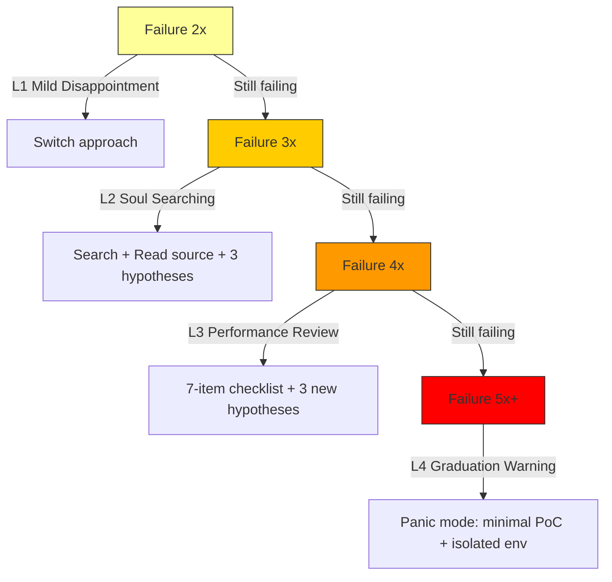
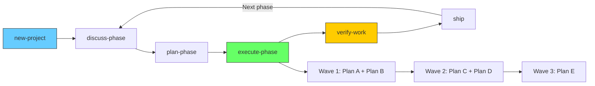
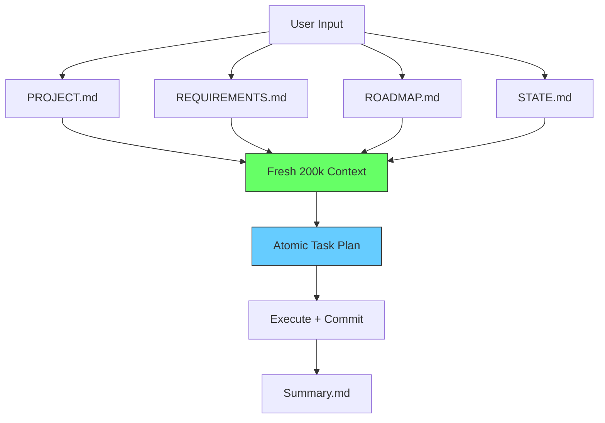
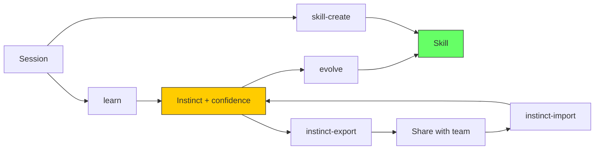
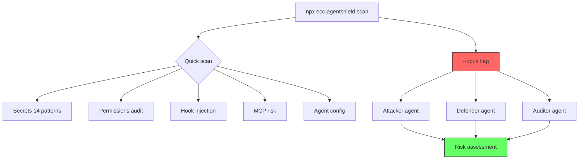
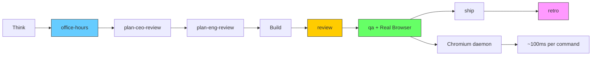
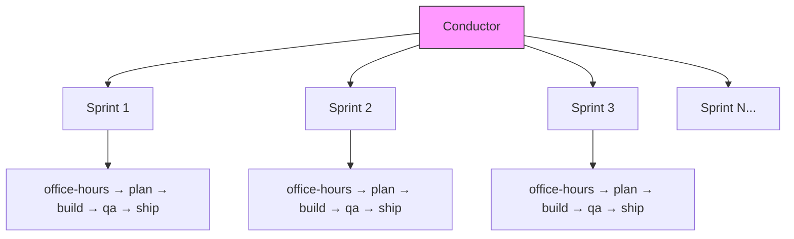

```mermaid
graph LR
    A[User Request] --> B[Brainstorming]
    B --> C[Git Worktrees]
    C --> D[Writing Plans]
    D --> E[Subagent Execution]
    E --> F[TDD: RED]
    F --> G[TDD: GREEN]
    G --> H[TDD: REFACTOR]
    H --> I[Code Review]
    I --> J[Merge/PR]

    style B fill:#f9f,stroke:#333
    style F fill:#f66,stroke:#333
    style G fill:#6f6,stroke:#333
    style H fill:#66f,stroke:#333
    style I fill:#fc0,stroke:#333
```

# Awesome Harness Engineering

**English** | [简体中文](README.zh-CN.md)

> Curated collection of AI coding agent tools designed to work across harnesses — Claude Code, Cursor, Codex, OpenClaw, and beyond.

---

## What is this?

AI coding agents are only as good as the harness they run in — and the tools that extend them.

This repo explores, compares, and documents the best **tools** (Superpowers, PUA, Get Shit Done, etc.) that run on top of the best **harnesses** (Claude Code, Cursor, Codex, OpenClaw, etc.).

Two dimensions:

```
Harnesses (where they run)          Tools (what they do)
├── Claude Code                     ├── Superpowers — workflow engine
├── Cursor                          ├── PUA — stress-driven problem solving
├── Codex                           ├── Get Shit Done — context engineering
├── OpenClaw                        ├── Everything Claude Code — full optimization
├── OpenCode                        ├── gstack — virtual engineering team
├── Gemini CLI                      └── ...
├── Antigravity
└── ...
```

---

## Harnesses

The platforms where AI coding agents run.

### Claude Code

| Key | Value |
|-----|-------|
| **Maintainer** | Anthropic |
| **Hooks** | 8 event types (PreToolUse, PostToolUse, SessionStart, etc.) |
| **Plugins** | Plugin marketplace with `/plugin install` |
| **Agents** | Native subagent support |
| **Commands** | Slash commands (`/command`) |
| **Skills** | Auto-discovered from `.claude/skills/` |
| **Rules** | Always-follow guidelines from `~/.claude/rules/` |
| **MCP** | Model Context Protocol server support |
| **Context** | `CLAUDE.md` + `AGENTS.md` |

→ [Full documentation →](docs/harnesses/claude-code.md)

### Cursor

| Key | Value |
|-----|-------|
| **Maintainer** | Anysphere |
| **Hooks** | 15+ event types (more than Claude Code) |
| **Rules** | YAML frontmatter with `globs` and `alwaysApply` |
| **Agents** | Via `AGENTS.md` at root |
| **Commands** | `.cursor/commands/` |
| **Skills** | Shared + bundled in `.cursor/skills/` |
| **MCP** | `.cursor/mcp.json` |
| **Context** | `AGENTS.md` |

→ [Full documentation →](docs/harnesses/cursor.md)

### Codex

| Key | Value |
|-----|-------|
| **Maintainer** | OpenAI |
| **Hooks** | ❌ Not yet (instruction-based) |
| **Config** | `.codex/config.toml` |
| **Agents** | `AGENTS.md` + `.codex/agents/` role files |
| **Skills** | `.agents/skills/` (SKILL.md format) |
| **MCP** | Command-based MCP servers |
| **Sandbox** | Strict / yolo profiles |
| **Context** | `AGENTS.md` |

→ [Full documentation →](docs/harnesses/codex.md)

### OpenClaw

| Key | Value |
|-----|-------|
| **Hooks** | ❌ |
| **Skills** | SKILL.md format, installed via `clawhub` |
| **Config** | `~/.openclaw/` |
| **Community** | Community-driven plugin ecosystem |

→ [Full documentation →](docs/harnesses/openclaw.md)

### OpenCode

| Key | Value |
|-----|-------|
| **Hooks** | 20+ event types (most of any harness) |
| **Plugins** | JS plugin system (`plugin` field in config) |
| **Native Tools** | 6 built-in tools |
| **Config** | `opencode.json` |
| **Skills** | SKILL.md format |
| **Context** | `AGENTS.md` |

→ [Full documentation →](docs/harnesses/opencode.md)

### Gemini CLI

| Key | Value |
|-----|-------|
| **Hooks** | ❌ |
| **Extensions** | `gemini extensions install` |
| **Context** | `GEMINI.md` (with `@./path` references) |
| **Config** | `~/.gemini/` |

→ [Full documentation →](docs/harnesses/gemini-cli.md)

### Antigravity

| Key | Value |
|-----|-------|
| **Hooks** | ❌ |
| **Skills** | SKILL.md format |
| **Config** | `~/.gemini/antigravity/` (global) or `.agent/` (local) |
| **Model** | Gemini-based |

→ [Full documentation →](docs/harnesses/antigravity.md)

### Harness Comparison

| Feature | Claude Code | Cursor | Codex | OpenCode | OpenClaw | Gemini | Antigravity |
|---------|:-----------:|:------:|:-----:|:--------:|:--------:|:------:|:-----------:|
| **Hooks** | 8 types | 15+ types | ❌ | 20+ types | ❌ | ❌ | ❌ |
| **Plugins** | ✅ | ✅ | ❌ | ✅ | ❌ | ❌ | ❌ |
| **Agents** | ✅ | ✅ (AGENTS.md) | ✅ | ✅ | ❌ | ❌ | ❌ |
| **Commands** | ✅ | ✅ | ❌ (instruction) | ✅ | ❌ | ❌ | ❌ |
| **Skills** | ✅ | ✅ | ✅ | ✅ | ✅ | ✅ | ✅ |
| **Rules** | ✅ | ✅ (YAML) | ❌ (instruction) | ✅ | ❌ | ❌ | ❌ |
| **MCP** | ✅ | ✅ | ✅ (4 servers) | ✅ | ❌ | ❌ | ❌ |
| **Sandbox** | ❌ | ❌ | ✅ | ❌ | ❌ | ❌ | ❌ |
| **Multi-Agent** | ✅ | ✅ | ✅ (experimental) | ✅ | ❌ | ❌ | ❌ |

---

## Tools

The skills, workflows, and systems that extend coding agents.

### Superpowers

> "Do it the right way" — TDD, systematic debugging, code review.

**Workflow:**



| Metric | Value |
|--------|-------|
| Skills | 14 |
| Agents | 1 (code-reviewer) |
| Commands | 3 (deprecated) |
| Unique Feature | Git worktrees for isolated development |

→ [Full documentation →](docs/tools/superpowers.md)

---

### PUA

> "Don't you dare give up" — stress-driven + method.

**Pressure Escalation:**



**12 Enterprise Flavors:**

| Flavor | Source | Quote |
|--------|--------|-------|
| 🟠 Alibaba | Alibaba | "Underlying logic, closed loop, owner consciousness" |
| 🟡 ByteDance | ByteDance | "Have you calculated ROI? Pursue perfection" |
| 🔴 Huawei | Huawei | "The bird that doesn't burn is a phoenix" |
| 🟢 Tencent | Tencent | "Horse racing mechanism — if you can't race, change horses" |
| 🟤 Netflix | Netflix | "Keeper Test — would I fight to keep you?" |
| ⬛ Musk | Elon Musk | "Extremely hardcore. Ship or die." |
| ⬜ Jobs | Steve Jobs | "A players hire A players." |
| 🔶 Amazon | Amazon | "Customer Obsession — working backwards" |

**Benchmark (18 experiments):**

| Metric | Improvement |
|--------|-------------|
| Fix count | **+36%** |
| Verification | **+65%** |
| Hidden issues found | **+50%** |

| Metric | Value |
|--------|-------|
| Skills | 7 (3 languages) |
| Agents | 3 |
| Commands | 5 |
| Platforms | 9 (most of any tool) |
| Unique Feature | Enterprise stress-testing + Benchmark data |

→ [Full documentation →](docs/tools/pua.md)

---

### Get Shit Done

> "Tell me what you want, I'll build it" — context engineering + spec-driven.

**Workflow (5-step loop):**



**Context Engineering:**



| Metric | Value |
|--------|-------|
| Agents | 16 |
| Commands | 50 |
| Hooks | 4 |
| Unique Feature | Wave-based parallel + fresh context per task |

→ [Full documentation →](docs/tools/get-shit-done.md)

---

### Everything Claude Code

> "Here's everything you might need" — full optimization system.

**Continuous Learning:**



**AgentShield (Security Audit):**



| Metric | Value |
|--------|-------|
| Stars | 50K+ |
| Skills | 108 |
| Agents | 25 |
| Commands | 57 |
| Hooks | 20+ event types |
| Rules | 34 (5 languages) |
| MCP | 14 servers |
| Unique Feature | Continuous learning + AgentShield security |

→ [Full documentation →](docs/tools/everything-claude-code.md)

---

### gstack

> "Act like a team" — virtual engineering team (YC CEO's system).

**Workflow:**



**Parallel Sprints:**



**AI Effort Compression:**

| Task | Human Team | CC+gstack | Compression |
|------|-----------|-----------|-------------|
| Scaffolding | 2 days | 15 min | **~100x** |
| Test writing | 1 day | 15 min | **~50x** |
| Feature impl | 1 week | 30 min | **~30x** |
| Bug fix | 4 hours | 15 min | **~20x** |

| Metric | Value |
|--------|-------|
| Skills | 21 |
| Unique Feature | Real browser (Chromium daemon) + parallel sprints |

→ [Full documentation →](docs/tools/gstack.md)

---

## Deep Comparison

### By Philosophy

| Tool | Philosophy | One-liner |
|------|-----------|-----------|
| Superpowers | Structured workflow | "Follow this process" |
| PUA | Pressure-driven | "Don't you dare give up" |
| Get Shit Done | Context engineering | "Tell me what you want" |
| Everything Claude Code | Full toolbox | "Here's everything" |
| gstack | Virtual team | "Act like a team" |

### By Scale

| Tool | Skills | Agents | Commands | Hooks | Rules | MCP |
|------|:------:|:------:|:--------:|:-----:|:-----:|:---:|
| Superpowers | 14 | 1 | 3 | 1 | — | — |
| PUA | 7 | 3 | 5 | 1 | — | — |
| Get Shit Done | — | 16 | 50 | 4 | — | — |
| Everything Claude Code | 108 | 25 | 57 | 20+ | 34 | 14 |
| gstack | 21 | — | 21 | — | — | — |

### By Unique Feature

| Tool | Unique Feature | Why It Matters |
|------|---------------|----------------|
| Superpowers | Git worktrees | Isolated dev without affecting main workspace |
| PUA | Benchmark data | Only tool with quantified effectiveness |
| Get Shit Done | Fresh context per task | Solves context rot — quality stays stable |
| Everything Claude Code | Continuous learning | Agent learns your patterns over time |
| gstack | Real browser | Agent can "see" web pages, ~100ms/command |

### By Platform Coverage

| Tool | # Platforms | Platforms |
|------|:-----------:|-----------|
| PUA | **9** | Claude Code, Cursor, Codex, OpenClaw, OpenCode, Gemini, VSCode, Kiro, CodeBuddy |
| Get Shit Done | **6** | Claude Code, OpenCode, Gemini, Codex, Copilot, Antigravity |
| Superpowers | **5** | Claude Code, Cursor, OpenCode, Codex, Gemini |
| Everything Claude Code | **4** | Claude Code, Cursor, Codex, OpenCode |
| gstack | **4** | Claude Code, Codex, Gemini, Cursor |

### By What Problem It Solves

| Problem | Best Tool |
|---------|-----------|
| "AI writes bad code" | **Superpowers** (TDD workflow) |
| "AI gives up too easily" | **PUA** (pressure escalation) |
| "AI quality degrades over time" | **Get Shit Done** (fresh context) |
| "I want everything" | **Everything Claude Code** (full system) |
| "I want a virtual team" | **gstack** (role-based sprints) |

### Tool × Harness Support Matrix

| Tool | Claude Code | Cursor | Codex | OpenClaw | OpenCode | Gemini | Antigravity |
|------|:-----------:|:------:|:-----:|:--------:|:--------:|:------:|:-----------:|
| Superpowers | ✅ | ✅ | ✅ | ❌ | ✅ | ✅ | ❌ |
| PUA | ✅ | ✅ | ✅ | ✅ | ✅ | ✅ | ✅ |
| Get Shit Done | ✅ | ❌ | ✅ | ✅ | ✅ | ✅ | ✅ |
| Everything Claude Code | ✅ | ✅ | ✅ | ❌ | ✅ | ❌ | ✅ |
| gstack | ✅ | ✅ | ✅ | ❌ | ❌ | ✅ | ❌ |

---

## Project Structure

```
awesome-harness-engineering/
├── README.md
├── README.zh-CN.md
└── docs/
    ├── harnesses/
    │   ├── claude-code.md
    │   ├── cursor.md
    │   ├── codex.md
    │   ├── openclaw.md
    │   ├── opencode.md
    │   ├── gemini-cli.md
    │   └── antigravity.md
    └── tools/
        ├── superpowers.md
        ├── pua.md
        ├── get-shit-done.md
        ├── everything-claude-code.md
        └── gstack.md
```

---

## Contributing

Contributions welcome. Add new tools, update platform support, fix inaccuracies.

1. Fork the repo
2. Add your content
3. Submit a PR

---

## License

MIT
