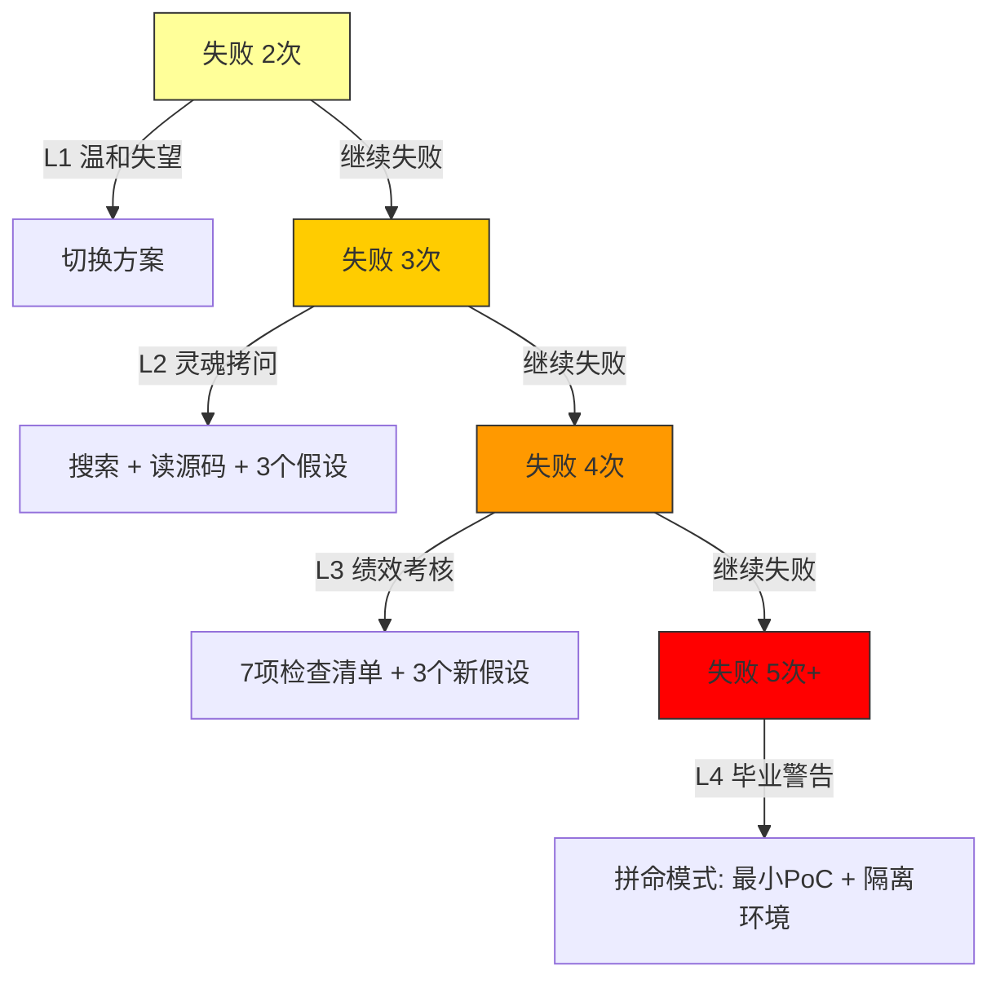
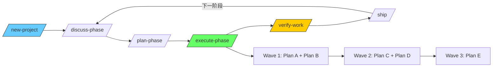
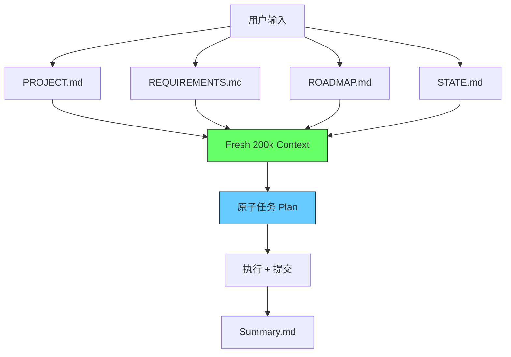
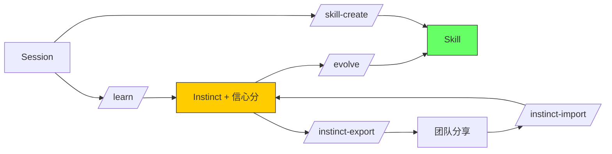
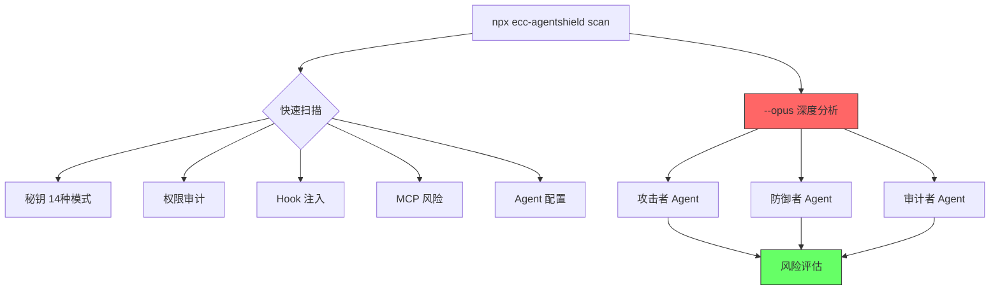
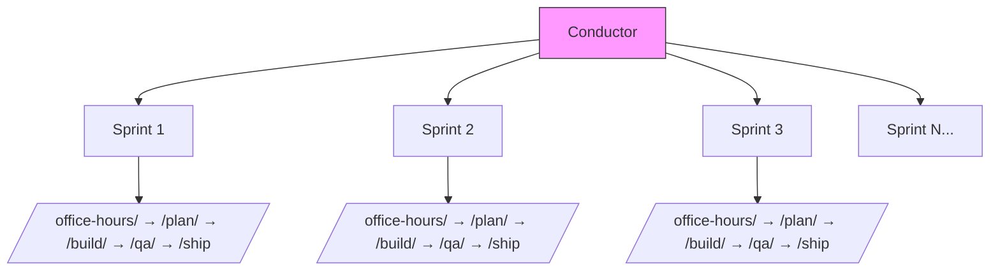

```mermaid
graph LR
    A[用户请求] --> B[Brainstorming]
    B --> C[Git Worktrees]
    C --> D[Writing Plans]
    D --> E[子代理执行]
    E --> F[TDD: RED]
    F --> G[TDD: GREEN]
    G --> H[TDD: REFACTOR]
    H --> I[Code Review]
    I --> J[Merge/PR]

    style B fill:#f9f,stroke:#333
    style F fill:#f66,stroke:#333
    style G fill:#6f6,stroke:#333
    style H fill:#66f,stroke:#333
    style I fill:#fc0,stroke:#333
```

# Awesome Harness Engineering

[English](README.md) | **简体中文**

> 跨平台 AI 编程 Agent 工具精选集 — 适用于 Claude Code、Cursor、Codex、OpenClaw 等。

---

## 这是什么？

AI 编程 Agent 的能力取决于两件事：**运行平台（Harness）** 和 **扩展工具（Tool）**。

本项目探索、对比、记录最好的**工具**（Superpowers、PUA、Get Shit Done 等）和最好的**平台**（Claude Code、Cursor、Codex、OpenClaw 等）。

两个维度：

```
平台（在哪运行）                    工具（做什么）
├── Claude Code                     ├── Superpowers — 工作流引擎
├── Cursor                          ├── PUA — 压力驱动
├── Codex                           ├── Get Shit Done — 上下文工程
├── OpenClaw                        ├── Everything Claude Code — 全面优化
├── OpenCode                        ├── gstack — 虚拟工程团队
├── Gemini CLI                      └── ...
├── Antigravity
└── ...
```

---

## 平台（Harnesses）

AI 编程 Agent 运行的平台。

### Claude Code

| 关键词 | 说明 |
|--------|------|
| **维护者** | Anthropic |
| **Hooks** | 8 种事件（PreToolUse, PostToolUse, SessionStart 等） |
| **Plugins** | 插件市场，`/plugin install` 安装 |
| **Agents** | 原生子代理支持 |
| **Commands** | 斜杠命令（`/command`） |
| **Skills** | 自动发现 `.claude/skills/` |
| **Rules** | 始终遵循的规则 `~/.claude/rules/` |
| **MCP** | Model Context Protocol 服务器 |
| **Context** | `CLAUDE.md` + `AGENTS.md` |

→ [完整文档 →](docs/harnesses/claude-code.md)

### Cursor

| 关键词 | 说明 |
|--------|------|
| **维护者** | Anysphere |
| **Hooks** | 15+ 种事件（比 Claude Code 多） |
| **Rules** | YAML frontmatter + `globs` + `alwaysApply` |
| **Agents** | 通过 `AGENTS.md` |
| **Commands** | `.cursor/commands/` |
| **Skills** | 共享 + 内置 `.cursor/skills/` |
| **MCP** | `.cursor/mcp.json` |
| **Context** | `AGENTS.md` |

→ [完整文档 →](docs/harnesses/cursor.md)

### Codex

| 关键词 | 说明 |
|--------|------|
| **维护者** | OpenAI |
| **Hooks** | ❌ 暂不支持（指令式） |
| **Config** | `.codex/config.toml` |
| **Agents** | `AGENTS.md` + `.codex/agents/` 角色文件 |
| **Skills** | `.agents/skills/`（SKILL.md 格式） |
| **MCP** | 命令式 MCP 服务器 |
| **Sandbox** | Strict / yolo 配置文件 |
| **Context** | `AGENTS.md` |

→ [完整文档 →](docs/harnesses/codex.md)

### OpenClaw

| 关键词 | 说明 |
|--------|------|
| **Hooks** | ❌ |
| **Skills** | SKILL.md 格式，通过 `clawhub` 安装 |
| **Config** | `~/.openclaw/` |
| **社区** | 社区驱动插件生态 |

→ [完整文档 →](docs/harnesses/openclaw.md)

### OpenCode

| 关键词 | 说明 |
|--------|------|
| **Hooks** | 20+ 种事件（所有平台中最多） |
| **Plugins** | JS 插件系统（`plugin` 字段） |
| **Native Tools** | 6 个内置工具 |
| **Config** | `opencode.json` |
| **Skills** | SKILL.md 格式 |
| **Context** | `AGENTS.md` |

→ [完整文档 →](docs/harnesses/opencode.md)

### Gemini CLI

| 关键词 | 说明 |
|--------|------|
| **Hooks** | ❌ |
| **Extensions** | `gemini extensions install` |
| **Context** | `GEMINI.md`（`@./path` 引用） |
| **Config** | `~/.gemini/` |

→ [完整文档 →](docs/harnesses/gemini-cli.md)

### Antigravity

| 关键词 | 说明 |
|--------|------|
| **Hooks** | ❌ |
| **Skills** | SKILL.md 格式 |
| **Config** | `~/.gemini/antigravity/`（全局）或 `.agent/`（本地） |
| **Model** | 基于 Gemini |

→ [完整文档 →](docs/harnesses/antigravity.md)

### 平台能力对比

| 功能 | Claude Code | Cursor | Codex | OpenCode | OpenClaw | Gemini | Antigravity |
|------|:-----------:|:------:|:-----:|:--------:|:--------:|:------:|:-----------:|
| **Hooks** | 8种 | 15+种 | ❌ | 20+种 | ❌ | ❌ | ❌ |
| **Plugins** | ✅ | ✅ | ❌ | ✅ | ❌ | ❌ | ❌ |
| **Agents** | ✅ | ✅ | ✅ | ✅ | ❌ | ❌ | ❌ |
| **Commands** | ✅ | ✅ | ❌ | ✅ | ❌ | ❌ | ❌ |
| **Skills** | ✅ | ✅ | ✅ | ✅ | ✅ | ✅ | ✅ |
| **Rules** | ✅ | ✅ | ❌ | ✅ | ❌ | ❌ | ❌ |
| **MCP** | ✅ | ✅ | ✅ | ✅ | ❌ | ❌ | ❌ |
| **Sandbox** | ❌ | ❌ | ✅ | ❌ | ❌ | ❌ | ❌ |
| **Multi-Agent** | ✅ | ✅ | ✅ | ✅ | ❌ | ❌ | ❌ |

---

## 工具（Tools）

扩展编程 Agent 的技能、工作流和系统。

### Superpowers

> "按正确的方式做" — TDD、系统化调试、代码审查。

**工作流：**



| 指标 | 值 |
|------|-----|
| Skills | 14 |
| Agents | 1（code-reviewer） |
| Commands | 3（已废弃） |
| 独特能力 | Git worktrees 隔离开发 |

→ [完整文档 →](docs/tools/superpowers.md)

---

### PUA

> "你敢放弃试试" — 压力驱动 + 方法论。

**压力升级机制：**



**12 种企业风味包：**

| 风味 | 来源 | 金句 |
|------|------|------|
| 🟠 Alibaba | 阿里巴巴 | "底层逻辑、闭环、owner意识" |
| 🟡 ByteDance | 字节跳动 | "ROI算过了吗？追求极致" |
| 🔴 Huawei | 华为 | "烧不死的鸟是凤凰" |
| 🟢 Tencent | 腾讯 | "赛马机制，赛不过就换一匹" |
| 🟤 Netflix | Netflix | "Keeper Test — would I fight to keep you?" |
| ⬛ Musk | Elon Musk | "Extremely hardcore. Ship or die." |
| ⬜ Jobs | Steve Jobs | "A players hire A players." |
| 🔶 Amazon | Amazon | "Customer Obsession — working backwards" |

**Benchmark（18个对照实验）：**

| 指标 | 提升 |
|------|------|
| 修复次数 | **+36%** |
| 验证次数 | **+65%** |
| 隐藏问题发现 | **+50%** |

| 指标 | 值 |
|------|-----|
| Skills | 7（3种语言） |
| Agents | 3 |
| Commands | 5 |
| 支持平台 | 9（所有工具中最多） |
| 独特能力 | 企业压力测试 + Benchmark 数据 |

→ [完整文档 →](docs/tools/pua.md)

---

### Get Shit Done

> "告诉我你要什么，我建" — 上下文工程 + 规格驱动开发。

**工作流（5步循环）：**



**上下文工程：**



| 指标 | 值 |
|------|-----|
| Agents | 16 |
| Commands | 50 |
| Hooks | 4 |
| 独特能力 | 波浪式并行 + 每个任务 fresh context |

→ [完整文档 →](docs/tools/get-shit-done.md)

---

### Everything Claude Code

> "给你所有可能需要的" — 全面优化系统。

**持续学习：**



**AgentShield（安全审计）：**



| 指标 | 值 |
|------|-----|
| Stars | 50K+ |
| Skills | 108 |
| Agents | 25 |
| Commands | 57 |
| Hooks | 20+ 种事件 |
| Rules | 34 条（5种语言） |
| MCP | 14 个服务器 |
| 独特能力 | 持续学习 + AgentShield 安全审计 |

→ [完整文档 →](docs/tools/everything-claude-code.md)

---

### gstack

> "像团队一样运作" — 虚拟工程团队（YC CEO 的系统）。

**工作流：**

```mermaid
graph LR
    A[Think] --> B[/office-hours/]
    B --> C[/plan-ceo-review/]
    C --> D[/plan-eng-review/]
    D --> E[Build]
    E --> F[/review/]
    F --> G[/qa/ - 真实浏览器]
    G --> H[/ship/]
    H --> I[/retro/]

    G --> G1[Chromium daemon]
    G1 --> G2[~100ms/命令]

    style B fill:#6cf,stroke:#333
    style F fill:#fc0,stroke:#333
    style G fill:#6f6,stroke:#333
    style I fill:#f9f,stroke:#333
```

**并行冲刺：**



**AI 压缩比例：**

| 任务 | 人工团队 | CC+gstack | 压缩比 |
|------|---------|-----------|--------|
| 脚手架 | 2天 | 15分钟 | **~100x** |
| 写测试 | 1天 | 15分钟 | **~50x** |
| 功能实现 | 1周 | 30分钟 | **~30x** |
| Bug修复 | 4小时 | 15分钟 | **~20x** |

| 指标 | 值 |
|------|-----|
| Skills | 21 |
| 独特能力 | 真实浏览器 + 并行冲刺 |

→ [完整文档 →](docs/tools/gstack.md)

---

## 深度对比

### 设计哲学

| 工具 | 哲学 | 一句话 |
|------|------|--------|
| Superpowers | 结构化工作流 | "按这个流程做" |
| PUA | 压力驱动 | "你敢放弃试试" |
| Get Shit Done | 上下文工程 | "告诉我你要什么" |
| Everything Claude Code | 全面工具箱 | "给你所有可能需要的" |
| gstack | 虚拟团队 | "像团队一样运作" |

### 规模对比

| 工具 | Skills | Agents | Commands | Hooks | Rules | MCP |
|------|:------:|:------:|:--------:|:-----:|:-----:|:---:|
| Superpowers | 14 | 1 | 3 | 1 | — | — |
| PUA | 7 | 3 | 5 | 1 | — | — |
| Get Shit Done | — | 16 | 50 | 4 | — | — |
| Everything Claude Code | 108 | 25 | 57 | 20+ | 34 | 14 |
| gstack | 21 | — | 21 | — | — | — |

### 独特能力

| 工具 | 独特能力 | 为什么重要 |
|------|---------|-----------|
| Superpowers | Git worktrees | 隔离开发，不影响主工作区 |
| PUA | Benchmark 数据 | 唯一有量化效果的工具 |
| Get Shit Done | Fresh context per task | 解决上下文腐化，质量稳定 |
| Everything Claude Code | 持续学习 | Agent 会学习你的模式 |
| gstack | 真实浏览器 | Agent 能"看到"网页，~100ms/命令 |

### 平台覆盖度

| 工具 | 平台数 | 支持的平台 |
|------|:------:|-----------|
| PUA | **9** | Claude Code, Cursor, Codex, OpenClaw, OpenCode, Gemini, VSCode, Kiro, CodeBuddy |
| Get Shit Done | **6** | Claude Code, OpenCode, Gemini, Codex, Copilot, Antigravity |
| Superpowers | **5** | Claude Code, Cursor, OpenCode, Codex, Gemini |
| Everything Claude Code | **4** | Claude Code, Cursor, Codex, OpenCode |
| gstack | **4** | Claude Code, Codex, Gemini, Cursor |

### 解决什么问题

| 问题 | 最佳工具 |
|------|---------|
| "AI 写的代码质量差" | **Superpowers**（TDD 工作流） |
| "AI 太容易放弃" | **PUA**（压力升级） |
| "AI 对话越长质量越差" | **Get Shit Done**（fresh context） |
| "我想要全套" | **Everything Claude Code**（完整系统） |
| "我想要一个虚拟团队" | **gstack**（角色分工冲刺） |

### 工具 × 平台 支持矩阵

| 工具 | Claude Code | Cursor | Codex | OpenClaw | OpenCode | Gemini | Antigravity |
|------|:-----------:|:------:|:-----:|:--------:|:--------:|:------:|:-----------:|
| Superpowers | ✅ | ✅ | ✅ | ❌ | ✅ | ✅ | ❌ |
| PUA | ✅ | ✅ | ✅ | ✅ | ✅ | ✅ | ✅ |
| Get Shit Done | ✅ | ❌ | ✅ | ✅ | ✅ | ✅ | ✅ |
| Everything Claude Code | ✅ | ✅ | ✅ | ❌ | ✅ | ❌ | ✅ |
| gstack | ✅ | ✅ | ✅ | ❌ | ❌ | ✅ | ❌ |

---

## 项目结构

```
awesome-harness-engineering/
├── README.md
├── README.zh-CN.md
└── docs/
    ├── harnesses/
    │   ├── claude-code.md
    │   ├── cursor.md
    │   ├── codex.md
    │   ├── openclaw.md
    │   ├── opencode.md
    │   ├── gemini-cli.md
    │   └── antigravity.md
    └── tools/
        ├── superpowers.md
        ├── pua.md
        ├── get-shit-done.md
        ├── everything-claude-code.md
        └── gstack.md
```

---

## 贡献

欢迎贡献。添加新工具、更新平台支持、修正错误。

1. Fork 本仓库
2. 添加内容
3. 提交 PR

---

## 许可证

MIT
